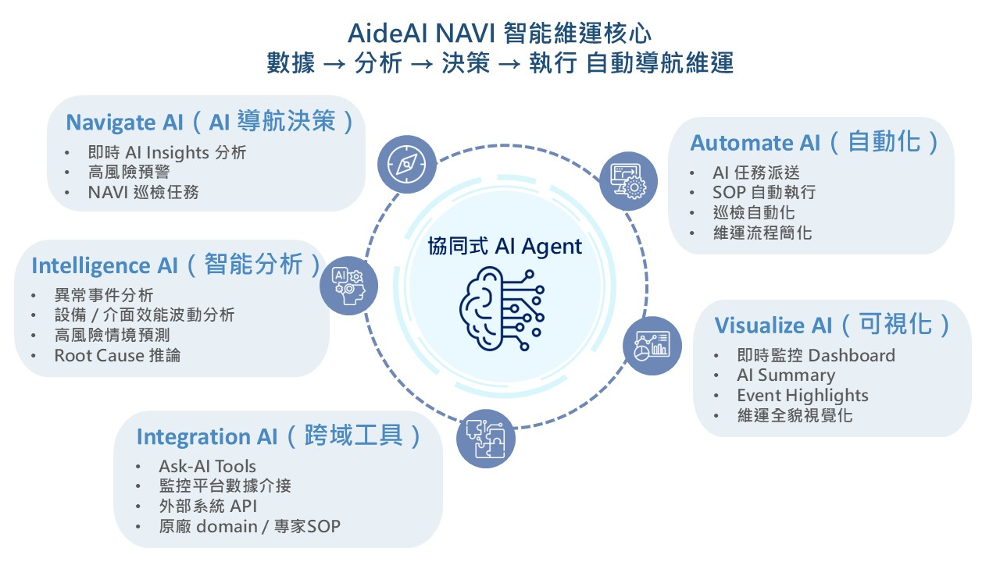

# NETCenter AideAI NAVI

由凌群電腦開發的「NETCenter AideAI NAVI」智能維運服務，旨在利用 AI 技術解決企業 IT 環境日益複雜所帶來的管理壓力。該產品核心採用協同式 AI Agent 與自然語言對話介面，將傳統的被動監控轉化為具備自動分析、預警及專家建議的「維運導航」模式。技術架構上整合了 Next.js、Spring AI 與 ETL 資料預處理，並強調地端部署以確保數據安全與資安防護。

目標客戶涵蓋金融、醫療及政府機關，透過人機協作優化運作效率，協助組織達成 ESG 永續管理與數位轉型的願景。此計畫不僅展示核心技術的驗證成果，更規劃未來朝向訂閱制與深化資安評估的發展路線圖。

## 🎯 解決痛點

傳統維運經常面臨巨大的壓力：

- 收到告警後，需要大量人工判讀與分析 。
- 仰賴人工判斷，且需要頻繁聯絡二線人員，溝通成本高昂 。
- AideAI NAVI 致力於解決人員流動造成的經驗流失、維運經驗難以累積，以及無效的溝通成本等問題 。

## 🔥 核心能力(Agentic AI)

AideAI NAVI 具備自主推理與決策、動態工具調用等核心功能，主要分為以下四大維度：

- 🧭 Navigate (AI 導航決策)：AI Insights 與專家智慧 SOP，提供即時 AI Insights 分析與高風險預警，並執行 NAVI 巡檢任務。
- 🤖 Automate (自動化)：執行關鍵任務與資料匯整。支援 AI 任務派送、SOP 自動執行與巡檢自動化，大幅簡化維運流程。
- 👁️ Visualize (可視化)：提供即時監控 Dashboard、AI Summary 及異常事件 Summary，實現維運全貌視覺化。
- 🧠 Intelligence (智能分析)：系統能即時進行異常事件與 CPU / Memory 波動分析；同時結合趨勢預測與 Root Cause 推論，協助團隊精準定位問題根本原因。

## 🛠️ 技術架構

- AideAI NAVI 採用 AI Agent 架構整合多種維運能力，AI Agent 可透過工具調用、資料分析、知識檢索，協助完成維運任務。

- AI 模型與推論：OpenAI、Ollama、Hugging Face 
- Agent 框架與核心：Spring AI Agent、RAG、Tools / MCP 
- 後端與資料處理：OpenJDK、Spring Boot Caching、Spring Batch、ETL 資料預處理 
- 向量資料庫：Chroma 
- 前端框架：Next.js  
- DevOps工具：Docker、GitHub、Gradle、OpenAPI 

### AideAI NAVI 透過 AI 與資料預處理技術重新定義 IT 維運模式，從 監控 → 分析 → 決策 → 執行，打造真正的智能維運平台

## ☎️ 聯繫

產品與專案技術聯繫人： Red Fan (Red_Fan@syscom.com.tw)
